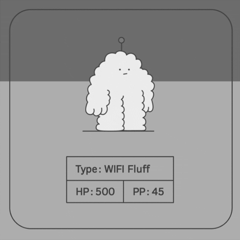
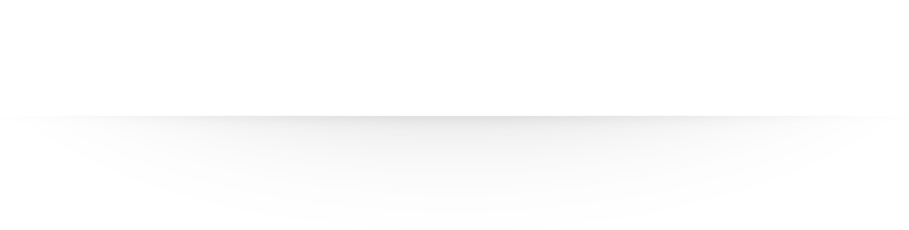

<!-- Gif-->

    <kbd>
        
    </kbd>

<!-- Gif end-->

<!--#################################################################-->
<h3 align="center">👉 Who am I ? 🤏</h3>

<!-- Separator -->

<!-- Separator end-->

    Highly ambitious, hardworking and innovative, that's who I am. My name is Nagib, I'm glad you read my profile.

    Do not hesitate to contact me by email for any collaboration, or simple 
    discussion.

<!-- Send email-->

    

<!-- Send email end-->

<!-- Separator -->

<!-- Separator end-->

<!--#################################################################-->
<h3 align="center">📋 Langages ✍🏼</h3>

<!-- Html logo -->
    ㅤ
<!-- Css logo -->
    ㅤ
<!-- Golang logo -->
    ㅤ
<!-- c++ logo -->
    
        
<!-- Swift logo -->
     ㅤ
<!-- Js logo -->
    ㅤ
<!-- Python logo -->
    

<!--#################################################################-->

<!-- Separator -->

<!-- Separator end-->

<h3 align="center">📯 Other Skils 🕹️</h3>

<!-- Html logo -->
    ㅤ
<!-- Css logo -->
    ㅤ
<!-- Golang logo -->
    ㅤ
<!-- c++ logo -->
    
        
<!-- Swift logo -->
     ㅤ
<!-- Js logo -->
    ㅤ
<!-- Python logo -->
    

